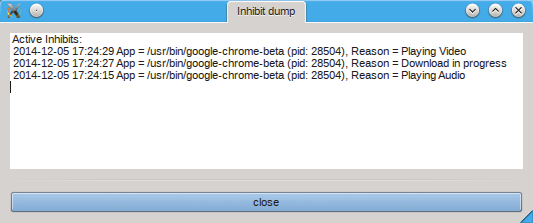

dbus-listen-inhibit
===================

Tool to check for dbus messages inhibiting sleep in power management. It does so by listening for messages in the session dbus inhibiting/uninhibiting power management, and the HasInhibitChanged message.

# Description 

The applications that want to keep the system awake do so by sending messages on the session dbus to org.freedesktop.PowerManagement asking it to inhibit system power management. For example:

```
method call sender=:1.787 -> dest=org.freedesktop.PowerManagement serial=3 path=/org/freedesktop/PowerManagement/Inhibit; interface=org.freedesktop.PowerManagement.Inhibit; member=Inhibit
   string "/usr/bin/google-chrome-beta"
   string "Playing Video"
```

When the application ends the task that prevents inhibit it does so by sending an UnInhibit message like:

```
method call sender=:1.787 -> dest=org.freedesktop.PowerManagement serial=4 path=/org/freedesktop/PowerManagement/Inhibit; interface=org.freedesktop.PowerManagement.Inhibit; member=UnInhibit
   uint32 275
```

org.freedesktop.PowerManagement (kded4 / powerdevil in my system) will keep track of the pending inhibits and send a message whenever the session Inhibit status changes like those:


```
signal sender=:1.2 -> dest=(null destination) serial=6392 path=/org/freedesktop/PowerManagement/Inhibit; interface=org.freedesktop.PowerManagement.Inhibit; member=HasInhibitChanged
   boolean true

signal sender=:1.2 -> dest=(null destination) serial=6403 path=/org/freedesktop/PowerManagement/Inhibit; interface=org.freedesktop.PowerManagement.Inhibit; member=HasInhibitChanged
   boolean false
```

# Usage

Just run it and observe the output it should start from a state with no pending inhibits:

```
$ qdbus org.freedesktop.PowerManagement /org/freedesktop/PowerManagement/Inhibit  org.freedesktop.PowerManagement.Inhibit.HasInhibit
false
```

And a green light:


The script will dump the active list of pending inhibits whenever there is a change on it, and also inform if sleep is possible or is inhibited.

It will signal that sleep is inhibitted by using a red light when sleep is inhibitted and sending a notify to the desktop whenever an application adds itself to inhibit or removes itself:


```
$ python dbus-listen-inhibit.py 

Active Inhibits:
2014-11-14 12:40:57 App = /usr/bin/google-chrome-beta (pid: 6462), Reason = Playing Video
Power management inhibited
Active Inhibits:
2014-11-14 12:40:57 App = /usr/bin/google-chrome-beta (pid: 6462), Reason = Playing Video

Active Inhibits:
2014-11-14 12:40:57 App = /usr/bin/google-chrome-beta (pid: 6462), Reason = Playing Video
2014-11-14 12:40:58 App = /usr/bin/google-chrome-beta (pid: 6462), Reason = Playing Audio

Active Inhibits:
2014-11-14 12:40:58 App = /usr/bin/google-chrome-beta (pid: 6462), Reason = Playing Audio

Sleep possible

```

You can use the right click button over the green|red light to see the about window, exit the tool, and to see the current tracked pending inhibits with "Show status":




You want a way to see the raw messages?
- `dbus-monitor --session interface=org.freedesktop.PowerManagement.Inhibit`.


